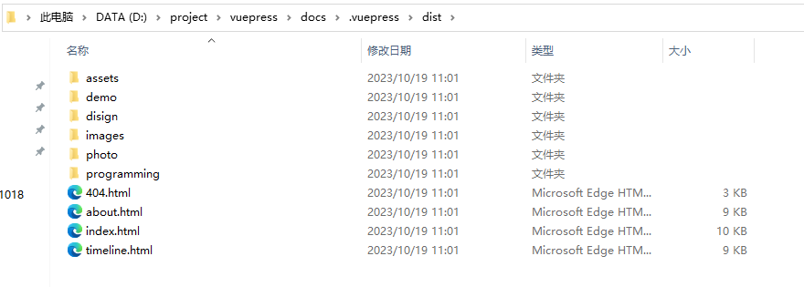

# 《使用vuepress V1.x快速构建个人博客》

## 阅读前提

​		此篇文章主要面向有一定前端开发基础人员撰写，如果你是完全不了解的小白，可以先学习前端基础和Vue后再了解此篇文章，当然你也可以不了解，跟着安装步骤走、也能够构建自己的个人博客。

​		这篇文章只说明在windows环境下构建vuepress V1.x个人博客，在阿里云服务器 CentOS系统的宝塔面板中上线项目。

## vuepress v1.x简要介绍

​		VuePress 由两部分组成：第一部分是一个[极简静态网站生成器 (opens new window)](https://github.com/vuejs/vuepress/tree/master/packages/%40vuepress/core)，它包含由 Vue 驱动的[主题系统](https://v1.vuepress.vuejs.org/zh/theme/)和[插件 API](https://v1.vuepress.vuejs.org/zh/plugin/)，另一个部分是为书写技术文档而优化的[默认主题](https://v1.vuepress.vuejs.org/zh/theme/default-theme-config.html)，它的诞生初衷是为了支持 Vue 及其子项目的文档需求。

​		每一个由 VuePress 生成的页面都带有预渲染好的 HTML，也因此具有非常好的加载性能和搜索引擎优化（SEO）。同时，一旦页面被加载，Vue 将接管这些静态内容，并将其转换成一个完整的单页应用（SPA），其他的页面则会只在用户浏览到的时候才按需加载。

## 文章概要

​		文章主要说明了vuepress v1.x 的构建和上线的过程，在此内容上简要说明和外链详细的构建需要安装的环境、环境安装的方法、上线需要的环境、上线所需要步骤等。

## 1、依赖环境

​		vuepress V1.x依赖node.js环境，你需要安装版本>8.6的[Node.js](https://nodejs.org/en)，[**Node.js安装和配置**](https://blog.csdn.net/qq_40593308/article/details/110559838)。

​		假设，你已经完成了Node.js的安装，能够正常使用Node.js和npm接下来我们开始安装和配置构建个人博客。

## 2、安装vuepress v1.x

​		

1. 创建并进入一个新目录

   ```bash
   mkdir vuepress-starter && cd vuepress-starter
   ```

2. 使用你喜欢的包管理器进行初始化

   ```bash
   npm init
   ```

   注意：这里初始化就是定义项目的配置文件，这一步自行编辑，亦可全部回车默认。

   

   - package name：项目名称，默认为当前的项目文件夹的名称（使用默认的话就`enter`回车即可）
   - version：项目版本，版本按照`x.x.x`的格式撰写，默认`1.0.0`
   - description：项目介绍，默认为空
   - entry point：项目入口文件，默认index.js
   - keywords：关键字
   - author：作者
   - license：开源许可协议（默认ISC）

   完成配置后输入y（yes)回车即可。

3. 将 VuePress 安装为本地依赖

   vuepress v1.x官方建议安装在开发环境中（vuepress V2.x 官方建议全局安装）

   ```bash
   npm install -D vuepress	（-D表示模块在开发环境安装，-S表示在生产环境安装，-g表示在全局环境安装）
   ```

4. 创建你的第一篇文档

   ```bash
   mkdir docs && echo '# Hello VuePress' > docs/README.md
   ```

5. 在 `package.json` 中添加一些 scripts

   这一步骤是可选的，但我们推荐你完成它。在下文中，我们会默认这些 scripts 已经被添加。

   ```json
   {
     "scripts": {
       "docs:dev": "vuepress dev docs",
       "docs:build": "vuepress build docs"
     }
   }
   ```

   

6. 在本地启动服务器

   ```bash
   npm run docs:dev
   ```

   VuePress 会在 [http://localhost:8080 (opens new window)](http://localhost:8080/)启动一个热重载的开发服务器。

7. 启动并打开项目

   

   

   ​		能够显示此页面，就表示项目已经基本构建，接下来，我们来了解以下项目结构和默认主题系统的配置，完善我们的个人博客。

## 3、项目结构

​		基本介绍我就不说了，可以自行查看 [Vuepress的目录结构文档](https://v1.vuepress.vuejs.org/zh/guide/directory-structure.html)，主要来说一下我自己的理解：

1. 单纯是一个博客的话，可以不用配置`.vuepress`中除了`config.js`外的其他文件和配置。

2. public下的静态文件，本地开发环境静态文件`/`路径就表示public目录下，`./`表示当前`md`的同目录下

3. 注意public下的静态文件，如果将项目上线在非根目录下，需要在 `.vuepress/config.js` 中设置 `base`

   1. 举例：如果你打算将你的网站部署到 `https://foo.github.io/bar/`，那么 `base` 的值就应该被设置为 `"/bar/"` (应当总是以斜杠开始，并以斜杠结束)，有了基础路径（Base URL），如果你希望引用一张放在 `.vuepress/public` 中的图片，你需要使用这样路径：`/bar/image.png`

4. `.vuepress/styles/palette.styl`用于重写默认的颜色常量，可以用来diy自己的博客配色

5. `.vuepress/styles/index.styl`则用来覆盖全局的默认样式

## 4、配置主题

​		我们可以看到，基本构建的个人博客什么都没有，接下来，我们来逐步配置我们的个人博客。
### 4.1、配置首页

​		我们根据官方的开发文档提供的首页配置案例，在根目录下的`README.md`输入：

```yaml
//docs/README.md
---
home: true
heroImage: /hero.png
heroText: Hero 标题
tagline: Hero 副标题
actionText: 快速上手 →
actionLink: /zh/guide/
features:
- title: 简洁至上
  details: 以 Markdown 为中心的项目结构，以最少的配置帮助你专注于写作。
- title: Vue驱动
  details: 享受 Vue + webpack 的开发体验，在 Markdown 中使用 Vue 组件，同时可以使用 Vue 来开发自定义主题。
- title: 高性能
  details: VuePress 为每个页面预渲染生成静态的 HTML，同时在页面被加载的时候，将作为 SPA 运行。
footer: MIT Licensed | Copyright © 2018-present Evan You
---
```

​		了解`yaml`语法，请阅读[yaml介绍](https://v1.vuepress.vuejs.org/zh/guide/frontmatter.html#%E5%85%B6%E4%BB%96%E6%A0%BC%E5%BC%8F%E7%9A%84-front-matter)。

​		保存后项目会自动刷新，刷新后页面显示如下：


​		其中页面的hero图片加载失败是因为public中没有`hero.png`，自行在public文件夹中添加图片，`heroImage:`属性的参数就是你图片的路径，'/'表示public目录。

​		下面是我完善的页面代码和页面：

```yaml
//docs/README.md
---
home: true
heroImage: /images/logo.png
heroText: GeiTE
tagline: 个人技术博客
actionText: 了解GeiTE->
actionLink: /about/
features:
- title: 设计(design)
  details: 设计的知识和实操的记录。(Design knowledge and operational record.)
- title: 程序(programming)
  details: 编程语言的技术和实操的记录。(Technical and practical documentation of programming languages.)
- title: 摄影(photo)
  details: 摄影艺术的学习和实操的记录。(A record of learning and practicing the art of photography.)
footer: MIT Licensed | Copyright © 2023-present Evan GeiTE
---
```


### 4.2、导航栏配置

​		当我们配置完首页后，我们发现现在页面中只有一个按钮可以跳转，而且跳转的连接也是404链接，我们接下来开始新建页面，配置导航栏，使得我们能够通过导航栏跳转到不同的页面中。

​		配置导航栏之前我们先新建一些文档，让后面配置的导航能够有跳转的页面。

​		文档都新建到`docs`目录下：


​		这里我新建了`disign目录`、`photo目录`、`programming目录`、`about.md文件`、`timeline.md文件`，一般目录里面需要有一个`README.md`默认文件，这样之后访问该目录会默认打开这个文件。所有新建的md文件简单数据点文字即可。

​		下面我们来配置导航，导航栏在`docs/.vuepress/config.js`中配置，导航栏配置包括`title`、`logo`、`nav`

**注意：.vuepress目录和config.js需要自行新建**

1. 导航栏title和logo

   ```js
   // .vuepress/config.js
   module.exports = {
     title: 'GeiTE'
     themeConfig: {
       logo: '/images/logo.png',
     }
   }
   ```

2. 导航栏链接

   ```js
   // .vuepress/config.js
   module.exports = {
     themeConfig: {
       nav: [
         { text: 'Home', link: '/' },
         { text: 'Guide', link: '/guide/' },
         { text: 'External', link: 'https://google.com' },	//外链会自动以新页面打开
         // 也可以通过target属性自行配置
         //{ text: 'External', link: 'https://google.com', target:'_self', rel:'' },
         //{ text: 'Guide', link: '/guide/', target:'_blank' }
       ]
     }
   }
   ```

   想要在导航栏中实现下拉列表，同items属性配置

   ```js
   // .vuepress/config.js
   module.exports = {
     themeConfig: {
       nav: [
         {
           text: 'Languages',
           ariaLabel: 'Language Menu',
           items: [
             { text: 'Chinese', link: '/language/chinese/' },
             { text: 'Japanese', link: '/language/japanese/' }
           ]
         }
       ]
     }
   }
   ```

   另外还可以通过在嵌套items在下拉列表中设置分组

   ```js
   // .vuepress/config.js
   module.exports = {
     themeConfig: {
       nav: [
         {
           text: 'Languages',
           items: [
             { text: 'Group1', items: [/*  */] },
             { text: 'Group2', items: [/*  */] }
           ]
         }
       ]
     }
   }
   ```

   这里根据自己的需要diy配置，我根据自己的需求配置如下：

   ```js
   module.exports = {
       title: 'GeiTE',
       description: 'GeiTE, GeiTE的博客网站, 记录学习过程, HTML, CSS, JavaScript, Vue, React, Node.js, 设计, 摄影',
       head: [
           ['link', { rel: 'icon', href: '/logo.png' }],
       ],
       port: 8666,
       smoothScroll: true,
   
       // 主题配置
       themeConfig: {
           // logo: '/images/logo.png',
           nav: [
               { text: '首页', link: '/' },
               { text: '设计', link: '/disign/'},
               { text: '程序', link: '/programming/'},
               { text: '摄影', link: '/photo/'},
               { text: '关于', link: '/about/' },
               { text: '时间线', link: '/timeline/' },
               {
                   text: '外链',
                   ariaLable: '外链',
                   items: [
                       { text:'GitHub', link: 'https://github.com/GeiTE' },
                       { text: 'Unsplash', link: 'https://unsplash.com/@geite' }
                   ]
               }
           ],
       }
   }
   ```

   

   ​		配置导航栏后，默认效果是在导航栏右边按照顺序显示，点击跳转到陪配置的链接中，如果是http/https开头的链接，系统会自动识别并添加上外链标志。

   


### 4.3、配置侧边栏

​		侧边栏的配置也是在`docs/.vuepress/config.js`中配置，配置后效果如下：


​		配置代码如下：

```js
//docs/.vuepress/config.js
module.exports = {
    title: 'GeiTE',
    description: 'GeiTE, GeiTE的博客网站, 记录学习过程, HTML, CSS, JavaScript, Vue, React, Node.js, 设计, 摄影',
    head: [
        ['link', { rel: 'icon', href: '/logo.png' }],
    ],
    port: 8666,
    smoothScroll: true,

    // 主题配置
    themeConfig: {
        // logo: '/images/logo.png',
        nav: [
            { text: '首页', link: '/' },
            { text: '设计', link: '/disign/'},
            { text: '程序', link: '/programming/'},
            { text: '摄影', link: '/photo/'},
            { text: '关于', link: '/about' },
            { text: '时间线', link: '/timeline' },
            {
                text: '外链',
                ariaLable: '外链',
                items: [
                    { text:'GitHub', link: 'https://github.com/GeiTE' },
                    { text: 'Unsplash', link: 'https://unsplash.com/@geite' }
                ]
            }
        ],
        sidebar: {
            '/disign/': [
                ['/disign/', '设计'],
            ],
            '/programming/': [
                ['/programming/', '程序'],
                ['/programming/pg_20231018/', 'vuepress快速构建个人博客'],
            ],
            '/photo/': [
                ['/photo/', '摄影'],
            ],
            '/': [
                '',
                'about',
                'timeline',
            ]
        },
    }
}
```

​		配置侧边栏的需要配置`themeConfig`的`sidebar`属性，`sidebar`是对象类型，这里可以自定义设置每个目录下的侧边栏配置。（每个页面也能够自己单独配置）

​		侧边栏的配置我们可以按照上面的`nav`对应的配置侧边栏，这里可以以一个目录为单位，给每个目录创建一个自定义侧边栏，也可以让系统自动配置侧边栏，自动配置代码：

```js
//docs/.vuepress/config.js module.exports/themeConfig
sidebar: 'auto',
```


​		系统自动配置侧边栏的效果就是按照文章md文件本身的目录进行显示。

​		到这一步基础的个人博客完整结构已经基本了解，接下来你就可以撰写文章，然后配置`config.js`正常的运营自己的个人博客了；接下来是一些扩展内容自定义配置的扩展内容，例如自定义默认主体的配色、自定义默认主体的样式的案例。

### 4.4、自定义配色、自定义样式

​		我们在之前的[3、项目结构](#_3、项目结构)的个人理解中有提到，`.vuepress/styles/palette.styl`用于重写默认的颜色常量，可以用来diy自己的博客配色；`.vuepress/styles/index.styl`则用来覆盖全局的默认样式。接下来我演示以下简单自定义的效果。

​		我希望我的博客是以紫蓝色为主色调，并且我感觉首页的`logo`太过平淡，我希望它有一个圆角、一个蓝紫色调的渐变阴影，凸显`logo`。

​		首先是配置整个博客的配色，我们需要在`docs/.vuepress/styles/`新建`palette.styl`文件，配置以下内容：

```stylus
// 颜色
$accentColor = #6B30F0
$textColor = #253659
$borderColor = #eaecef
$codeBgColor = #282c34
$arrowBgColor = #ccc
$badgeTipColor = #30F0DB
$badgeWarningColor = darken(#ffe564, 35%)
$badgeErrorColor = #DA5961

// 布局
//$navbarHeight = 3.6rem
//$sidebarWidth = 20rem
//$contentWidth = 740px
//$homePageWidth = 960px

// 响应式变化点
//$MQNarrow = 959px
//$MQMobile = 719px
//$MQMobileNarrow = 419px
```

​		palette.styl中能够配置项目中的样式常量，一般配置的包括：配色、布局、响应式。在这里配置后会应用到整个系统中；按照上面的样式重写后的页面效果如下：


​		下面我们丰富以下首页`logo`的效果，我们需要在`docs/.vuepress/styles/`新建`index.styl`文件，配置以下内容：

```stylus
//例如，我想给我首页的logo添加圆角和光效阴影

//.vuepress/styles/index.styl
// 修改首页logo图片为圆角
.home .hero img {
    border-radius: 12%;
    box-shadow: 10px 10px 30px rgba(107, 48, 240, 0.2), -10px -10px 30px rgba(240, 226, 48, 0.1);
}
```


**`index.styl`中的样式优先级高于默认样式，因此在此重写样式能够覆盖原有样式**

​		如果你不知道如何找到需要修改样式的标签，你可以先运行项目，在浏览器中打开开发者模式，点击检查按钮，然后选择需要修改的地方，右下角会显示标签对应的`css`标签定义语句。


​		完成了博客项目的diy配置和内容的撰写，接下来我们需要将项目上线，即能够被外网访问到。

## 5、项目上线

​		项目上线，即项目能够被外网访问到，上线的方法有很多种，有简单的有复杂的，例如你不想购买服务器，你可以在自己电脑运行，通过`IPv6`或者进行内网穿透使得外网能够访问（有一定安全隐患）；购买服务器和域名、配置服务器、部署项目（因为打包后时静态项目，倒是不用什么运行环境）；或者使用一些的云开发静态页面托管平台，例如`uniCloud`、`CloudBase`、`GitHub Pages`等。

​		在此我主要讲如何部署到阿里云服务器中和部署到`uniCloud`中；其中`uniCloud`是免费的，提供的默认域名比较复杂，如果你想要简单好记的域名可以自己购买一个域名，配置到`uniCloud`网站托管中。

### 5.1、项目打包

​		上线项目前，我们需要打包我们的项目，`vuepress`项目并不是像普通的`html`静态项目一样，直接放到服务器就可以运行的，从之前我们需要安装`Node.js`、通过`npm`初始化、下载`vuepress`项目包、通过`npm run docs:dev`运行项目这么多步骤就可以推理出，想要在服务器上直接运行未打包的项目的话，你需要讲这些环境配置步骤在服务器中重复一遍；并且源码项目的各种环境和文件占的性能和存储空间对比打包后的项目大太多，这样不利于服务器运行，因此我们需要讲项目配置好后打包成不需要依赖各种包和环境（或者仅依赖应用服务器环境的）的正式项目包。

​		`vuepress`项目中内置了`webpack`打包工具，我们只需要在终端中输入我们之前在配置文件`package.json`配置的`npm run docs:build`，就会调用`webpack`帮你打包文件，打包文件默认打包到`docs/.vuepress/dist/`文件夹中，终端中显示`Compiled successfully`字样的话就打包完成了。



**注意：这是你直接打开index.html页面服务正常访问，因为项目所有资源是按域名根目录定位的，直接打开js、css等等资源都无法加载。**

​		接下来我们只需要将打包好的文件放到域名的根目录下即可，首先我演示的是再`uniCloud`部署：

#### 5.1.1、uniCloud部署

1. 进入[`uniCloud`网站](https://unicloud.dcloud.net.cn/pages/login/login)

   

2. 没账号的点击注册，注册完登录，有账号的直接登录即可,进入到`服务空间列表页`，点击右上角的`新建服务空间`

   

3. 进入到`服务空间购买页`，我们服务商选择`阿里云`，服务空间按照要求取个名字，付费方式选择`免费`，我这里因为已经创建了一个免费的服务空间，因此选择不了，免费的只有一种套餐，没有版本可选择，并且一次只能购买一个月，每个月需要到`服务空间列表`点击一下续费（0元续费），如果超过一定时间就会清空数据，所以如果要长期使用，记得每月续费；然后点击购买，他就会创建服务空间了。

   

4. 购买并且服务空间阿里云初始化完成后，就会显示在`服务空间列表`中，点击右侧`详情`按钮，进入配置。

   

5. 点击左侧边栏的`前端网页托管`选项，接下里就可以点击`上传到当前目录`，将打包好的静态文件上传上去

   **注意：这里上传稍微有些麻烦，目录只能单个单个上传，删除的话，要先删除目录中的文件，目录也会自动删除。**

   

6. 当将所有的内容都上传完后，点击`参数配置`选项，查看我们的默认域名复制域名到浏览器中访问即可。

   

   

#### 5.1.2、阿里云服务器宝塔面板部署

​		使用阿里云部署的话，首先你要购买阿里云服务器和域名，服务器学生可以买一两百的学生机，然后几十块买个域名这些配置篇幅有点长了，可以查看这篇文章：[阿里云服务器搭建及宝塔面板安装（图文教程）](https://blog.csdn.net/qq_45767923/article/details/123334026)，假设你已经配置好了阿里云服务器，并且使用了宝塔面板，那么你可以按照下面的步骤将个人静态博客项目部署上去。

1. 你可以选择在域名根目录下部署，或者非根目录

   **如果你在非根目录部署，请参考[3、项目结构](#_3、项目结构)的第三点，配置你的项目路径**

   ​		这里说明的是在根目录下部署，如果你不想在自己的一级域名下部署，你可以在阿里云域名解析里创建一个二级域名，然后在宝塔面板中新建一个网站，在这个网站的根目录部署。

   ​		所谓部署，因为这个是静态页面，所以没有什么环境要求，直接将项目文件上传到网站的根目录下即可。


​		
